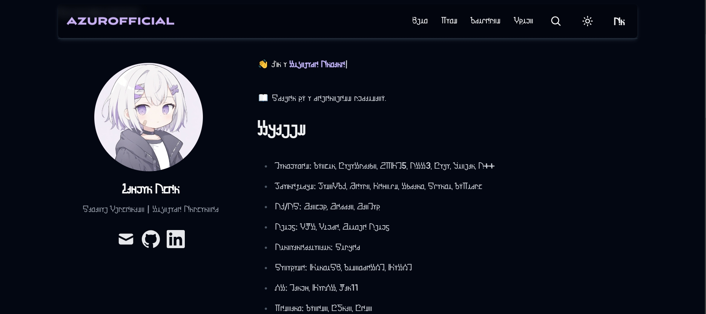

<div align="center">
  
</div>

---



# AmosChenZixuan Personal Blog

Based off the [**Tailwind Nextjs Starter Blog**](https://github.com/timlrx/tailwind-nextjs-starter-blog)

This is a [Next.js](https://nextjs.org/), [Tailwind CSS](https://tailwindcss.com/) project which is based on Next App directory with [React Server Component](https://nextjs.org/docs/getting-started/react-essentials#server-components) and uses [Contentlayer](https://www.contentlayer.dev/) to manage markdown content.

## Addtional Features by Me

- Internationalization
  - Supports English and Chinese.
- Customized Font
- Smart Nav Bar
  - Hides itself and reappears by scrolling
- Parallax Scrolling Tags
- Spotify Status
  - Displays currently playing song
  - If no song is playing, displays the last played song
- Image Viewer
  - Supports dragging and zooming
- Photo Gallery (Work in Progress)
  - Responsive and compact grid of images
  - Supports sharing and external links
- Resume (To-Do)
  - Timeline with cool scrolling animations

## Original Features From the Template

- Next.js with Typescript
- [Contentlayer](https://www.contentlayer.dev/) to manage content logic
- Easy styling customization with [Tailwind 3.0](https://tailwindcss.com/blog/tailwindcss-v3) and primary color attribute
- [MDX - write JSX in markdown documents!](https://mdxjs.com/)
- Near perfect lighthouse score - [Lighthouse report](https://www.webpagetest.org/result/230805_BiDcBQ_4H7)
- Lightweight, 85kB first load JS
- Mobile-friendly view
- Light and dark theme
- Font optimization with [next/font](https://nextjs.org/docs/app/api-reference/components/font)
- Integration with [pliny](https://github.com/timlrx/pliny) that provides:
  - Multiple analytics options including [Umami](https://umami.is/), [Plausible](https://plausible.io/), [Simple Analytics](https://simpleanalytics.com/), Posthog and Google Analytics
  - Comments via [Giscus](https://github.com/laymonage/giscus), [Utterances](https://github.com/utterance/utterances) or Disqus
  - Newsletter API and component with support for Mailchimp, Buttondown, Convertkit, Klaviyo, Revue, and Emailoctopus
  - Command palette search with [Kbar](https://github.com/timc1/kbar) or Algolia
- Server-side syntax highlighting with line numbers and line highlighting via [rehype-prism-plus](https://github.com/timlrx/rehype-prism-plus)
- Math display supported via [KaTeX](https://katex.org/)
- Citation and bibliography support via [rehype-citation](https://github.com/timlrx/rehype-citation)
- Automatic image optimization via [next/image](https://nextjs.org/docs/basic-features/image-optimization)
- Support for tags - each unique tag will be its own page
- Support for multiple authors
- 3 different blog layouts
- 2 different blog listing layouts
- Support for nested routing of blog posts
- Projects page
- Preconfigured security headers
- SEO friendly with RSS feed, sitemaps and more!

## Installation

#### Prerequisite: Node and Yarn

```bash
curl -o- https://raw.githubusercontent.com/nvm-sh/nvm/v0.38.0/install.sh | bash
nvm install 18
nvm use 18

npm i --global yarn
```

```bash
yarn
```

Please note, that if you are using Windows, you may need to run:

```bash
set PWD="$(pwd)"
```

## Development

First, run the development server:

```bash
yarn dev
```

Open [http://localhost:3000](http://localhost:3000) with your browser to see the result.

Edit the layout in `app` or content in `data`. With live reloading, the pages auto-updates as you edit them.
